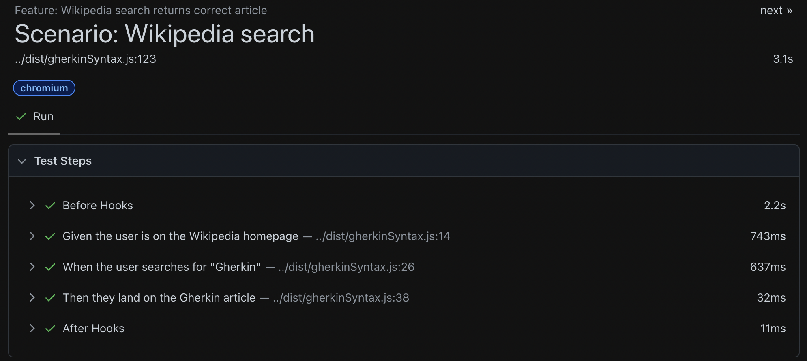

# gherkin-lite

A lightweight, TypeScript-first Gherkin-style DSL for [Playwright](https://playwright.dev/).  
Easily write expressive tests using `Given`, `When`, `Then`, `Feature`, and `Scenario` — no `.feature` files or Cucumber required.

Ideal for teams that want readable, business-aligned test reports *without* introducing extra complexity.

> Check out the official [Cucumber reference](https://cucumber.io/docs/gherkin/reference/) for good practices in writing Gherkin.

## ✨ Features

- ✅ Human-readable BDD syntax (`given`, `when`, `then`, `and`, `but`)
- ✅ `feature` and `scenario` helpers
- ✅ Type-safe and compatible with `@playwright/test`
- ✅ Zero runtime dependencies
- ✅ Works with JavaScript and TypeScript



> 💡 Tip: Run tests with `npx playwright test --reporter=html` and open the report with `npx playwright show-report` to view detailed step-by-step output.

## 📦 Installation

```bash
npm install gherkin-lite
```

> Requires [`@playwright/test`](https://playwright.dev/) in your project.

## 🚀 Usage

### Basic Example

```ts
import { expect } from '@playwright/test';
import { given, when, then, feature, scenario } from 'gherkin-lite';

feature('search "Gherkin" on Wikipedia', async () => {
  scenario('Wikipedia search', async ({ page }) => {
    await given('the user is on the Wikipedia homepage', async () => {
      await page.goto('https://en.wikipedia.org');
    });

    await when('the user searches for "Gherkin"', async () => {
      await page.getByPlaceholder('Search Wikipedia').first().fill('Gherkin');
      await page.getByRole('button', { name: 'Search' }).click();
    });

    await then('they land on the Gherkin article', async () => {
      await expect(page).toHaveURL(/\/wiki\/Gherkin/);
    });
  }, { tags: ['@wikipedia'] });
});
```
**🔍 Filter tagged tests**
You can run specific tagged scenarios using Playwright’s ``--grep`` option:
``npx playwright test --grep @wikipedia``

### Scenario Outline
``gherkin-lite`` does not include a built-in `scenarioOutline` function. Instead, you can achieve the same effect using a loop over examples:

```ts
const examples = [
  { a: 1, b: 2, expected: 3 },
  { a: 10, b: 5, expected: 15 }
];

for (const { a, b, expected } of examples) {
  scenario(`adds ${a} + ${b} = ${expected}`, async () => {
    const result = a + b;
    expect(result).toBe(expected);
  });
}
```

### 📦 Sharing context between steps
To persist data between `given`, `when`, and `then` steps inside a `scenario`, use a plain object as shared context.

```ts
scenario('adding two numbers with context', async ({ }) => {
  const ctx: any = {};

  await given('two numbers', async () => {
    ctx.a = 5;
    ctx.b = 7;
  });

  await when('they are added together', async () => {
    ctx.result = ctx.a + ctx.b;
  });

  await then('the result should be correct', async () => {
    if (ctx.result !== 12) {
      throw new Error(`Expected 12, but got ${ctx.result}`);
    }
  });
});
```

## 🧱 API Reference

| Function                                   | Description                                                        |
|--------------------------------------------|--------------------------------------------------------------------|
| `given(description, fn)`                   | Marks a "Given" step in the test                                   |
| `when(description, fn)`                    | Marks a "When" step                                                |
| `then(description, fn)`                    | Marks a "Then" step                                                |
| `and(description, fn)`                     | Optional continuation step                                         |
| `but(description, fn)`                     | Optional exception step                                            |
| `feature(description, fn)`                 | Defines a group of related scenarios (a "Feature")                 |
| `scenario(description, fn, options?)`      | Defines an individual test scenario                                |
| `scenario.skip(description, fn, options?)` | Skips the scenario (e.g., if it's not relevant in some contexts)  |
| `scenario.only(description, fn, options?)` | Runs only this scenario (useful for debugging)                    |
| `scenario.todo(description)`              | Declares a scenario that hasn't been implemented yet              |

## 🛠 Development

```bash
npm install
npm run build
npm test
```

## 🤔 Why I Built This

I like the clarity of Gherkin syntax (`Given–When–Then`), but not the overhead of Cucumber.

In my experience:
- Business people almost never write tests, even if you give them `.feature` files.
- Adding a whole Cucumber layer to a Playwright project often creates more friction than value.
- Most teams just want **readable test reports** that map cleanly to user stories.

So instead of adding Cucumber, I added semantics to what I already had:  
Playwright + `test.step()` + a little structure.

**`gherkin-lite`** gives you the BDD clarity — `given`, `when`, `then`, `scenario`, `feature` — without any extra tooling.  
It works out of the box with Playwright, generates clean reports, and is fully TypeScript-friendly.

No plugins. No DSL parser. No `.feature` files.  
Just simple structure that makes your tests easier to read, debug, and explain to stakeholders.

## 📄 License

MIT © [Federico Silva]